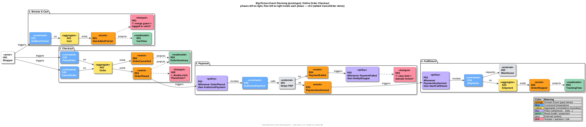
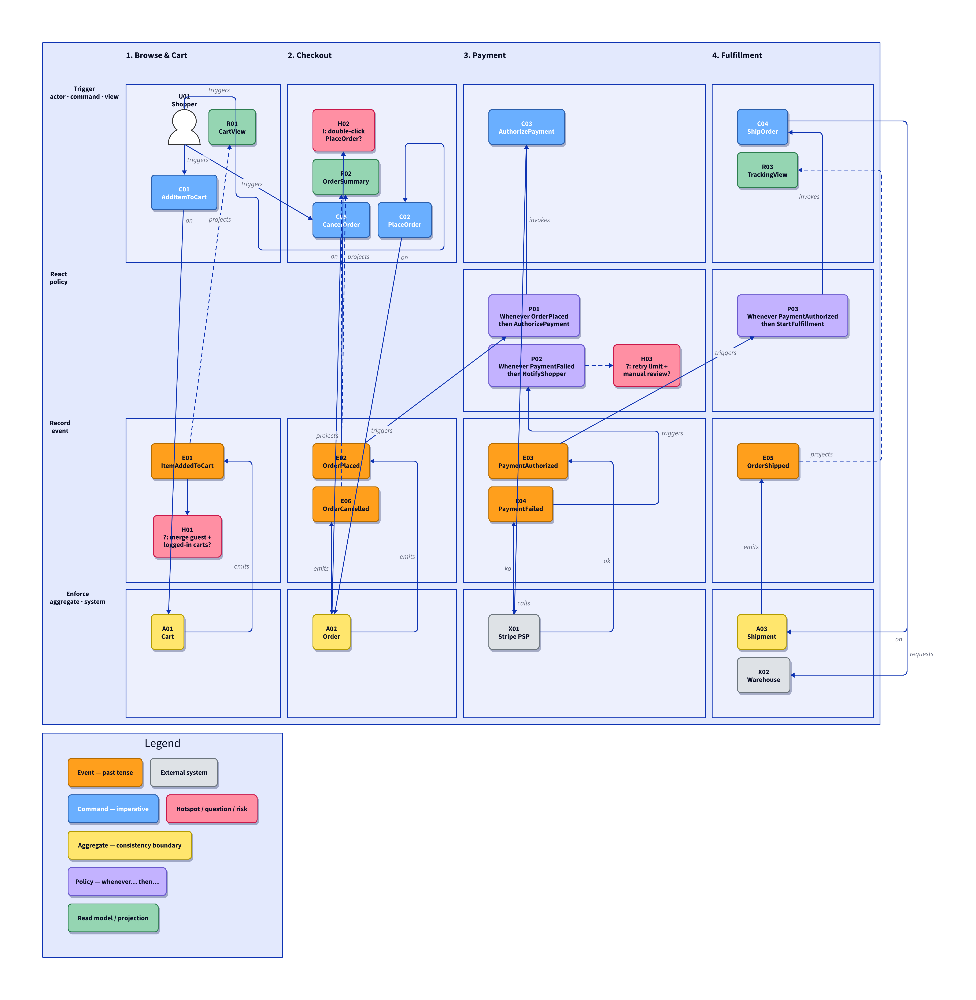

# Event-Storming with a Coding Agent — PlantUML vs D2 Prototype

Same event-storming board (Online Order Checkout: 7 events, 5 commands,
3 aggregates, 3 policies, 3 read models, 2 externals, 3 hotspots),
kept in two sibling text-based variants so you can feel the workflow
difference with an agent like Claude Code.

## Layout

- `plantuml/` — `event-storming.puml` + `render.sh` (needs Java +
  `plantuml.jar`; Smetana layout, no Graphviz). See its README.
- `d2/` — `event-storming.d2` + `render.sh` (needs the `d2` binary;
  TALA layout, convention grid). See its README.
- Each folder has its own `CLAUDE.md` (agent operating rules) and
  renders its own SVG/PNG. Stable IDs (`E02_OrderPlaced`, …) match
  across both, so prompts and reviews transfer 1:1.

## Boards

### PlantUML

### D2 (convention grid: aggregates below the event spine)

## Quick comparison (from actually rendering both)

|                     | PlantUML (`plantuml/`)              | D2 (`d2/`)                              |
|---------------------|-------------------------------------|-----------------------------------------|
| Toolchain           | Java + 25 MB jar                    | single `d2` binary                      |
| Layout engine       | Smetana (built-in)                  | TALA (bundled; dagre/elk available)     |
| Wall fidelity       | chronological, slightly scattered   | convention grid: phases × bands, aggregates below events |
| Sticky look         | boxes + stereotype tags             | rounded boxes + shadows, person actor   |
| Legend              | `legend` block                      | vertical chip stack                     |
| Live preview        | PlantUML VS Code ext. / server      | `d2 --watch` / D2 VS Code ext.          |
| PNG/SVG export      | two java passes                     | `d2 in.d2 out.png` built in             |
| Format/lint         | none                                | `d2 fmt`, `d2 validate`                 |
| Sketch mode         | no                                  | `d2 --sketch` (hand-drawn look)         |

Honest take: D2 renders the nicer wall here with the lighter toolchain,
and `validate`/`fmt`/`watch` make the agent loop smoother. PlantUML wins
if your org already standardises on it or you need its UML diagram kinds
next to the board. Both beat screenshots of Miro for git-diff review.

## Try it (same loop, either folder)

cd plantuml && ./render.sh   # or: cd d2 && ./render.sh
# 1. "List hotspots H01-H03 with one-line resolutions each, no edits yet."
# 2. "Apply the H02 one: add policy P04, re-render."
# 3. Review: git diff <file> + the PNG. Keep / revert / adjust.

## CI

Per-folder PNG/SVG and `.generated/` are git-ignored build outputs.
`.generated/` is the published mirror: `.github/workflows/render.yml`
rebuilds both boards on push/PR touching either variant, force-adds
the results (`git add -f`, the only writer) and commits them back on
push — so the images above always reflect the latest board sources. PRs from
forks still validate via the `event-storming-boards` artifact upload
(30 days). A red build means a board source broke — same failure as
`./render.sh`.

Suggested next: push to a remote for backup/sharing, then replace
checkout with your own domain (keep the ID scheme and
one-concept-per-edit rule).
